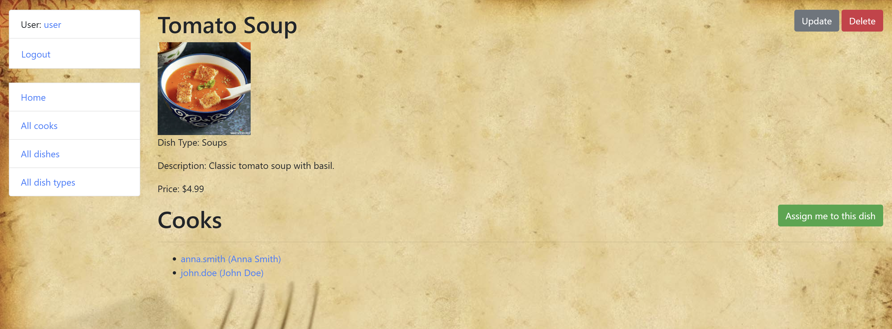

# Restaurant Project

Django project for managing dishes and cooks in Restaurant

## Check it out!

[Restaurant project deployed to Render](https://restaurant-mate-ww2z.onrender.com/)

## Installation

Python3 must be already installed

```shell
git clone https://github.com/AIL8888/restaurant-mate
cd restaurant_mate
python -m venv venv
venv\Scripts\activate
pip install -r requirements.txt
python manage.py makemigrations 
python manage.py migrate
python manage.py loaddata restaurant_db_data.json
python manage.py test
python manage.py runserver  # starts Django Server
```

## Features

* Authentication functionality for Cook/User
* Managing dishes cooks & dish types directly from website interface
* Powerful admin panel for advanced managing

### Test user

Login: user  
Password: user12345

## Demo


